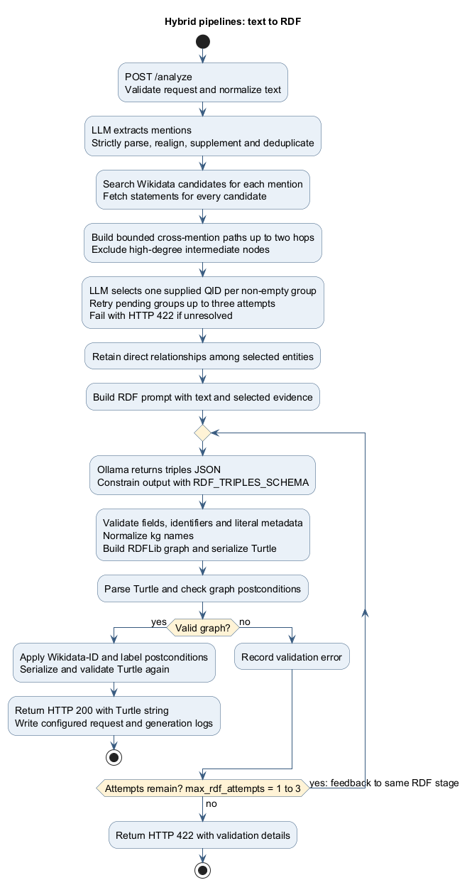
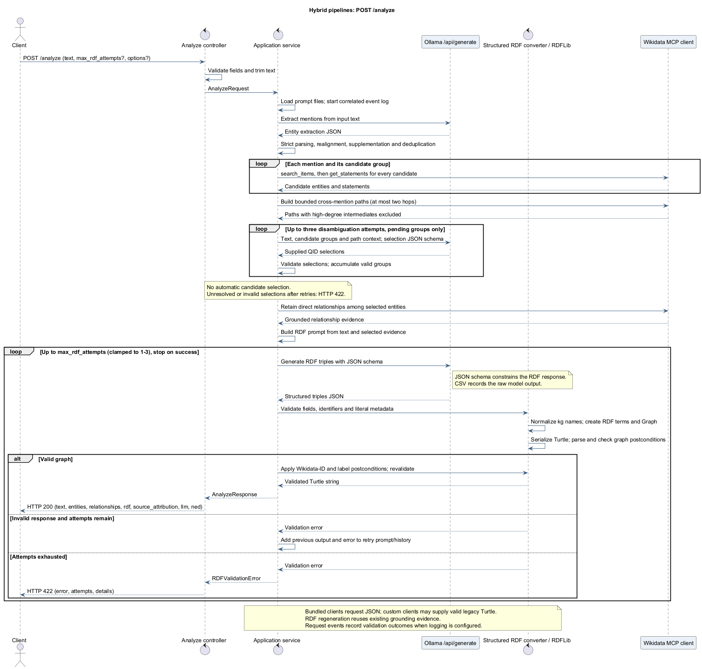

# Diagrams

## Pipeline diagrams





Editable sources: [process](seq/process.puml) and [sequence](seq/analyze.puml).
The figures describe the bundled Ollama clients and default grounding configuration.

To regenerate with Java and a local PlantUML JAR, run from the repository root:

```bash
java -jar /path/to/plantuml.jar -tpng -o ../figures docs/seq/process.puml docs/seq/analyze.puml
```

PlantUML 1.2025.2 was used for the committed PNGs. Render both sources whenever the
pipeline changes, then inspect the images for clipped labels or missing branches.
The hybrid and prompt repositories also retain `figures/process.jpg` as a JPEG
export of the same process figure for existing links.
