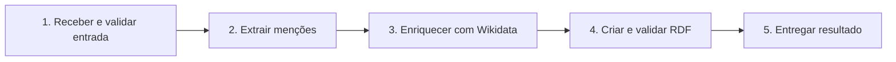
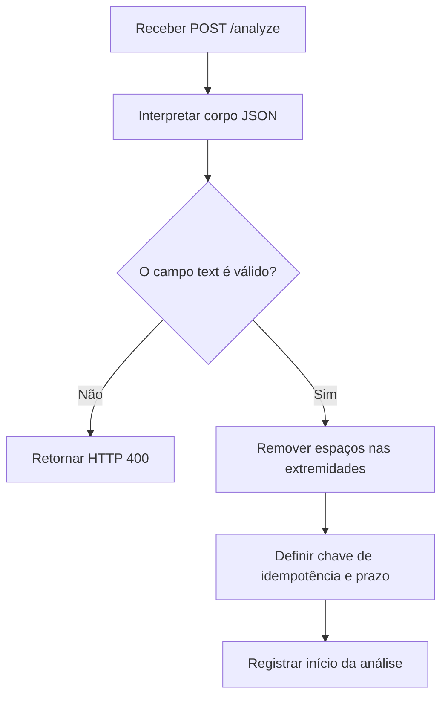
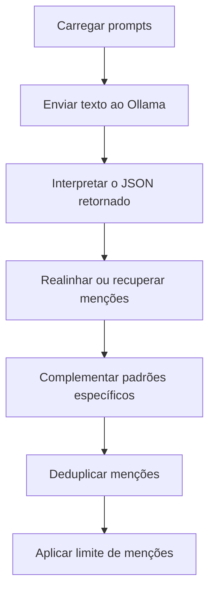
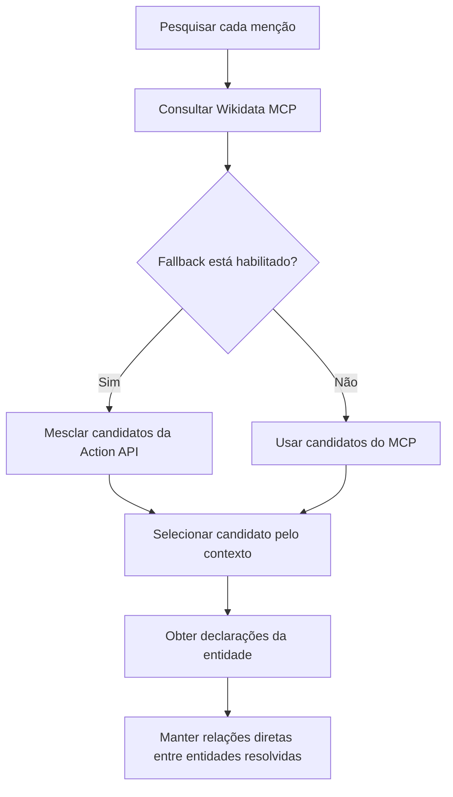
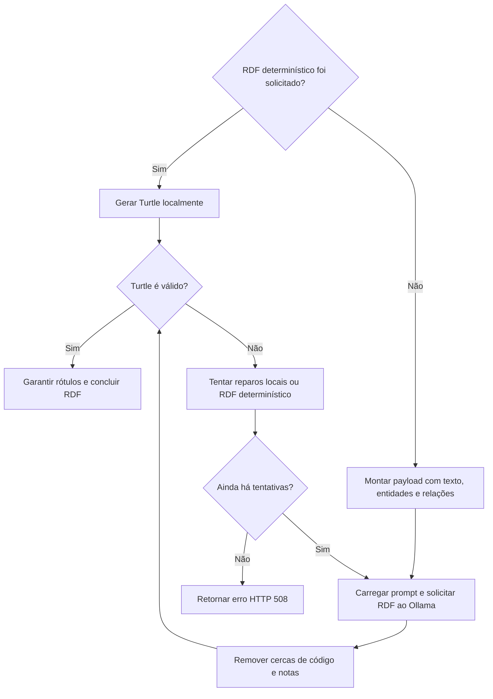
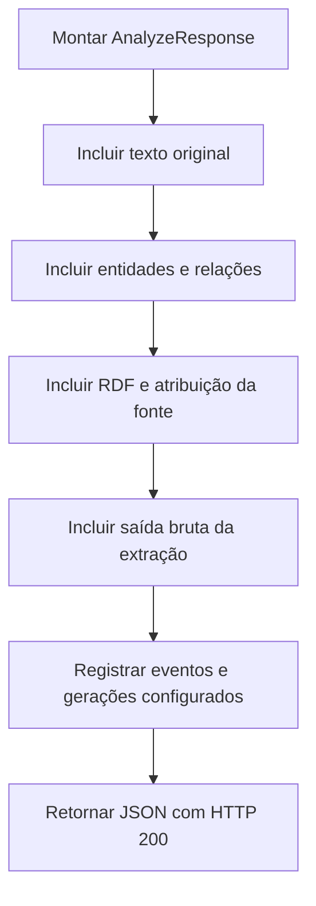

# Fluxograma do processo de criação do grafo de conhecimento

Este documento apresenta o fluxo do endpoint `POST /analyze`. O primeiro
diagrama resume o processo em cinco macroblocos; os diagramas seguintes abrem
cada um deles em um nível operacional.

## Visão de alto nível

## 1. Receber e validar entrada

**Saída do bloco:** texto normalizado e parâmetros de execução.

## 2. Extrair menções

**Saída do bloco:** lista de menções de entidades e conceitos encontradas no
texto.

## 3. Enriquecer com Wikidata

**Saída do bloco:** entidades identificadas, suas declarações e relações
diretas fundamentadas na Wikidata.

## 4. Criar e validar RDF

**Saída do bloco:** grafo serializado em RDF/Turtle válido ou erro de
validação após o limite de tentativas.

## 5. Entregar resultado

**Saída do bloco:** resposta JSON com o grafo, as evidências utilizadas e os
metadados da análise.

## Observações transversais

- O prazo restante é verificado entre as etapas principais; estouros de tempo
  são convertidos em HTTP 504.
- Falhas de serviços externos são convertidas em HTTP 502.
- Os eventos da análise e as gerações do Ollama são registrados quando os
  respectivos caminhos de log estão configurados.
